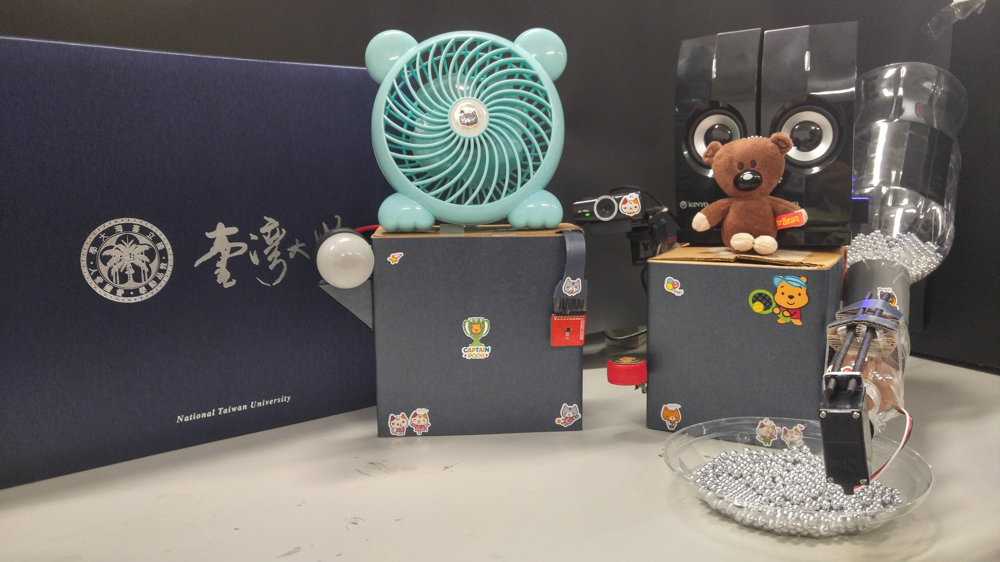

# Meow Meow

> This project is dedicated to our beloved Meow Meow (2005--2022).
>
> 

_Meow Meow_ is a smart pet interaction system that allows you to remotely interact with your pet(s) while monitoring the environment. We implement the system in Node.js and HTML/CSS with Tessel 2 boards, Socket.IO and Firebase. This is our final project for _Embedded Systems Labs_ (EE 3021) at National Taiwan University in Spring 2017.

## Features

- Web user interface
- Real-time video streaming
- Temperature and humidity monitoring
- Calling your pets (with prerecorded audio)
- Receiving calls from your pets (press the button and call)
- Feeding your pets with automatic food dispenser (remotely controllable)

## Hardware List

- Two Tessel 2 boards
- Climate module
- Servo module
- Relay module
- USB audio module
- USB camera module
- GPIO button

> For more information, please visit our project [website](https://salu133445.github.io/meow-meow/).
