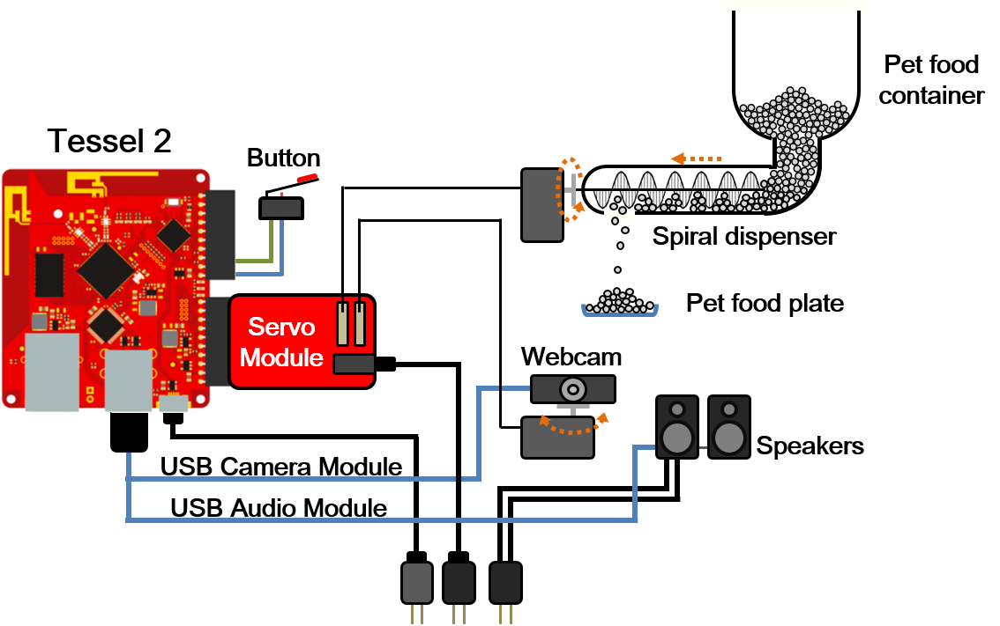

# Interactive Feeding System

System diagram

## Server

- establish a local host using *socket*_.io_

## Button (via GPIO)

- enable your pet to call you

## Servo module

- control the direction of the camera
- control the pet food dispenser (see [here](implementation) for details)

## USB camera module

- stream live video

## USB audio module

- play recorded voice message when you call
- play recorded voice message when you feed remotely

Interactive feeding system

