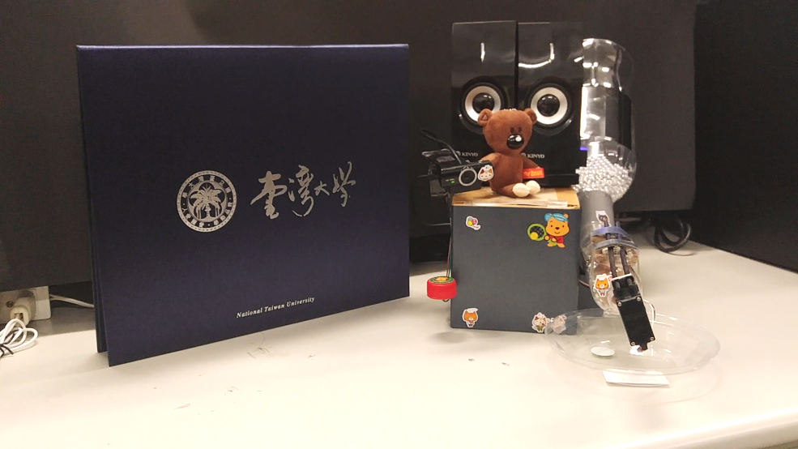
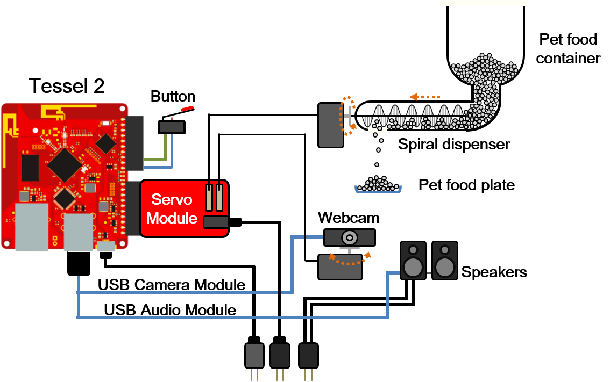

# Feeding System

## Server

- Establish a local host using _Socket.IO_

## Button (via GPIO)

- Enable your pet to call you

## Servo module

- Control the direction of the camera
- Control the pet food dispenser (see [here](implementation) for details)

## USB camera module

- Stream live video

## USB audio module

- Play recorded voice message when you call
- Play recorded voice message when you feed remotely

