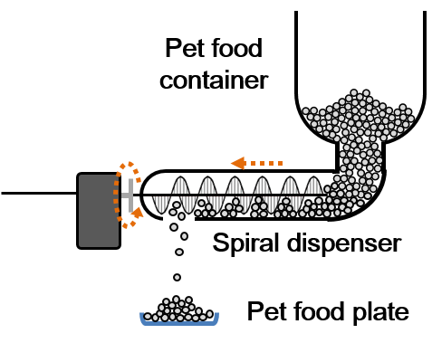

# Implementation Details

## How does the automatic pet food dispenser work?

The automatic pet food dispenser consists of a pet food container, a spiral dispenser and a pet food plate. The spiral dispenser is connected to the servo motor. Once the servo motor is triggered and start rotating, the spiral dispenser will push the pet food out.

## How do we use Firebase API to establish robust connection?

We try to construct a request/response connection model between the browser(which acts like a client) and the environmental monitoring system(which acts like a server). To illustrate the idea, we take light control for example and some trivial checks are skipped. Note that true means 'on'/'turn on' and false means 'off'/'turn off' for relay/status.lightIsOn and relay/command.switchLight.

- Whenever the user click the light bulb button, the client will check if relay/command.switchLight is equal to relay/status.lightIsOn. If so, then the client will change relay/command.switchLight into the target state. If relay/command.switchLight is not equal to relay/status.lightIsOn, it means the server has not completed the last command sent by the clients so we simply skip it..
- The server listens on relay/command.switchLight. Whenever its value is changed, the server will change the relay controlling the light bulb into the target state.
- After the server has successfully change the state, the server will change the relay/status.lightIsOn into the current state of the relay controlling the light bulb. Note that this is why we say if relay/command.switchLight is not equal to relay/status.lightIsOn, it means the server has not completed the last command sent by the clients.
- The client listens on relay/status.lightIsOn. Whenever its value is changed, the client will change the unlighted light bulb image into lighted light bulb image or in the opposite way.
