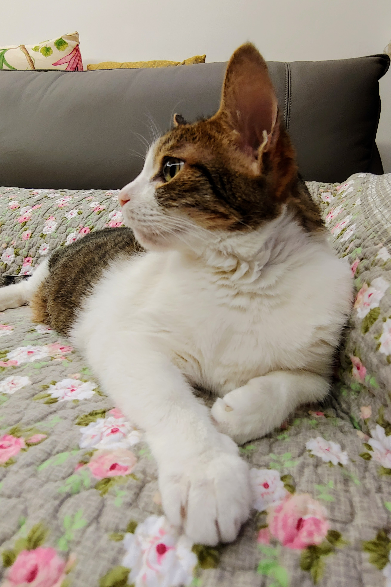

> This project is dedicated to our beloved Meow Meow (2006--2022).
>
> {:style="max-width: 200px;"}

_Meow Meow_ is a smart pet interaction system that allows you to remotely interact with your pet(s) while monitoring the environment. We implement the system in Node.js and HTML/CSS with Tessel 2 boards, Socket.IO and Firebase. This is our final project for _Embedded Systems Labs_ (EE 3021) at National Taiwan University in Spring 2017.


