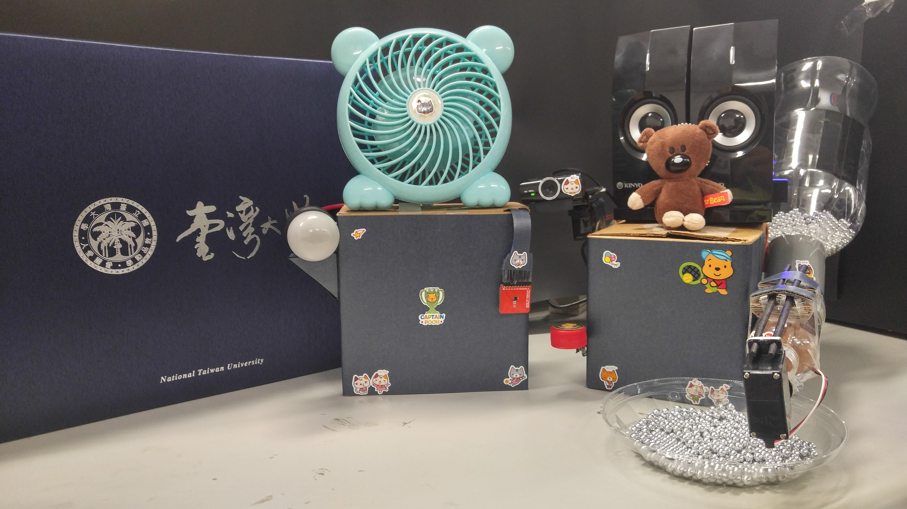

*Meow Meow*, an intelligent pet interaction system, allows you to remotely monitor the temperature and humidity condition, control the light and fan and on top of that, interact with your pets. We use two *Tessel 2* boards to build up the environment monitoring system and the interactive feeding system (one board for each system).

- Web user interface
- Real-time video streaming
- Temperature and humidity monitoring
- Calling your pets (with prerecorded audio)
- Receiving calls from your pets (press the button and call)
- Feeding your pets with automatic food dispenser (remotely controllable)

