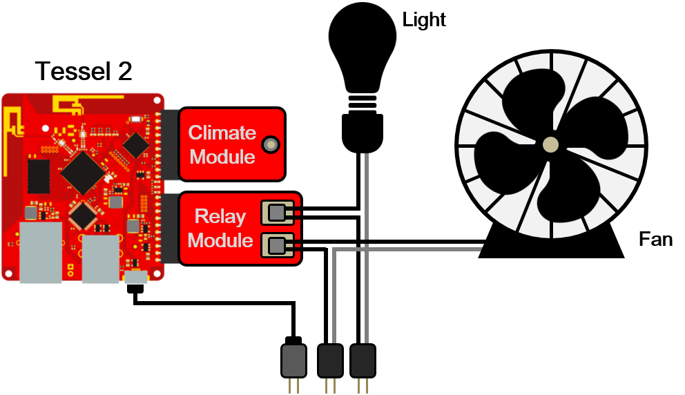

# Environment Monitoring System

System diagram of the environment monitoring system

## Climate module

- monitor the temperature and humidity
- update climate/temperature and climate/humidity in Firebase real-time database
- update climate/hot to true when the temperature rises over 28oC and update climate/hot to false when the temperature drops below 25 oC

## Relay module

- control the fan and the light bulb
- automatically turn on the fan when temperature rises
- automatically turn on the light at night(18:00~06:00) and turn it off at daytime(06:00~18:00)
- enable clients to send request to control the fan and the light bulb

Environment monitoring system

