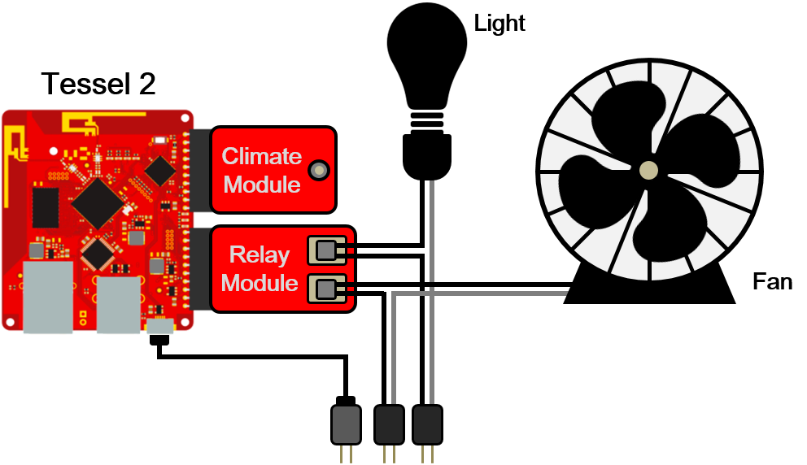

# Monitoring System

## Climate module

- Monitor the temperature and humidity
- Update climate/temperature and climate/humidity in a _Firebase_ real-time
  database
- Update climate/hot to true when the temperature rises over 28&deg;C and update
  climate/hot to false when the temperature drops below 25&deg;C

## Relay module

- Control the fan and the light bulb
- Automatically turn on the fan when temperature rises
- Automatically turn on the light at nighttime (18:00~06:00) and turn it off
  at daytime (06:00~18:00)
- Enable clients to send request to control the fan and the light bulb

