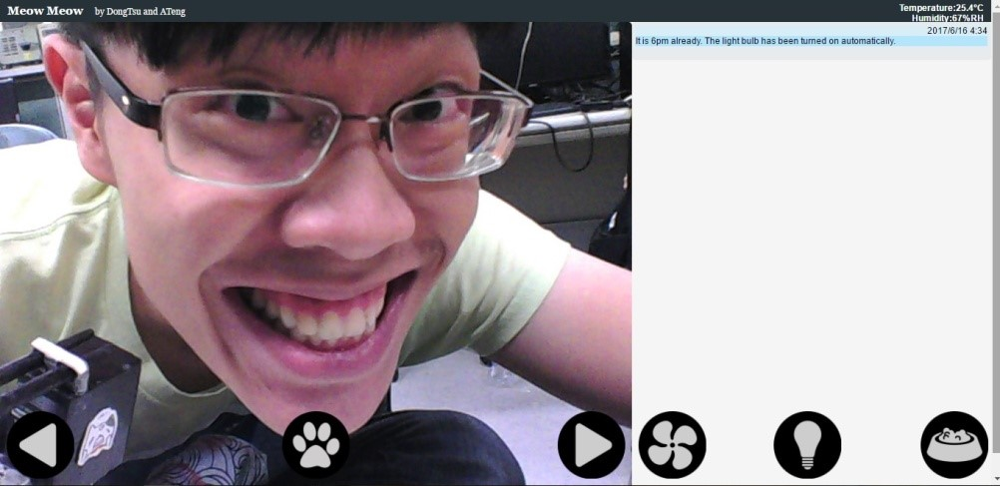
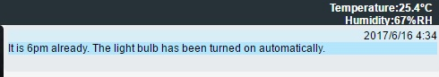

# User Interface

{:.caption}
User interface

## Firebase API

- Connect to a _Firebase_ real-time database
- Fetch climate data updated by the environmental monitoring system
- Acquire the state of relay module of the environmental monitoring system
- Send relay control request when the fan/light buttons are clicked (see
  [here](implementation) for details)

## Message List

- Show messages when your pet calls you by pressing the button
- Show messages when the temperature rises over 28&deg;C
- Show messages when the light bulb has been automatically turned on at night
- Show date and time information of the messages

{:.caption}
Message list and climate information bar

## Buttons

- Camera control
  - Trigger the servo module
  - Adjust the direction (left/right) of camera
- Call meow
  - Trigger the audio module
  - Your pets will hear your prerecorded voice
- Fan switch
  - Trigger the relay module
  - Turn on/off the fan
- Light switch
  - Trigger the relay module
  - Turn on/off the light
- Feed button
  - Trigger the servo module
  - Activate the feeding system
  - Trigger the audio module
  - Your pets will hear your prerecorded voice
