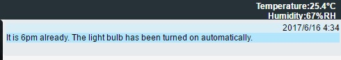
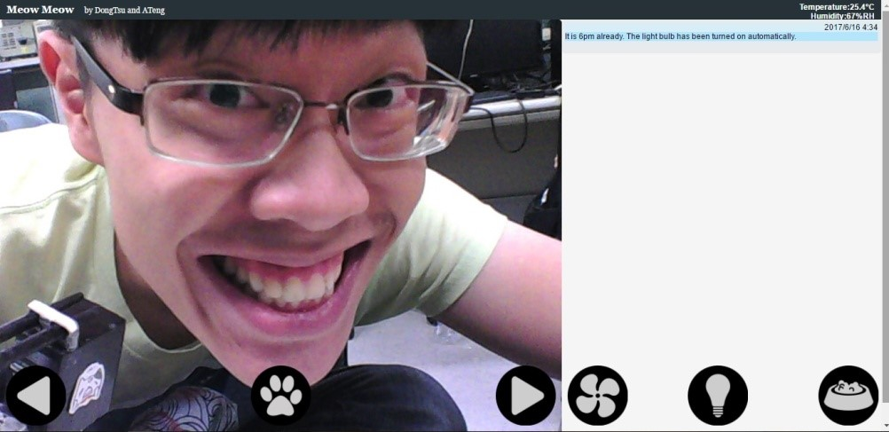

# User Interface

## Firebase API

- connect to Firebase realtime database
- fetch climate data updated by the environmental monitoring system
- acquire the state of relay module of the environmental monitoring system
- send relay control request when the fan/light buttons are clicked(will be elaborated in Sec. 5)

## Message List

- show messages when your pet calls you by pressing the button
- show messages when the temperature rises over 28oC
- show messages when the light bulb has been automatically turned on at night
- show date and time information of the messages

Message list and climate information bar

## Buttons

- Camera control
  - trigger the servo module
  - adjust the direction (left/right) of camera
- Call meow
  - trigger the audio module
  - your pets will hear your prerecorded voice
- Fan switch
  - trigger the relay module
  - turn on/off the fan
- Light switch
  - trigger the relay module
  - turn on/off the light
- Feed button
  - trigger the servo module
  - activate the feeding system
  - trigger the audio module
  - your pets will hear your prerecorded voice

User interface

